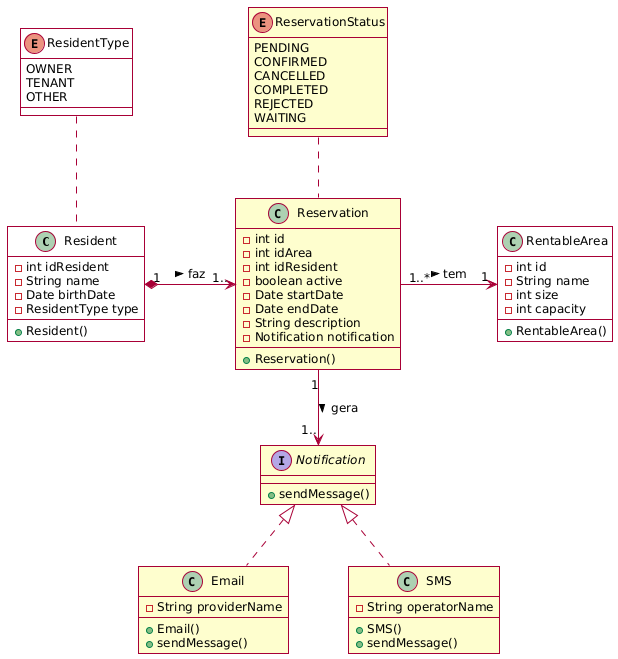

## MSReservation

Microservice for managing reservations of rentable areas, following the logic that a resident can rent a common rentable area for a specific purpose at a predetermined cost per area. This microservice is used to validate the case study, as it requires information contained in <b>rentable area</b> (MSCondominium) and <b>resident</b> (MSResident), and still needs a logical transformation of the objects to retrieve only the information necessary for the business rules of the application. The class diagram is shown below:

Note the difference between the resident and rentable area entities in the reservation microservice compared to the respective source data microservices. The notation that indicates it comes from another microservice is the white background of the class.

Implementation details are as follows:
- OpenJDK 21
- SpringFramework 3.4.4
- MariaDB 11.7.2