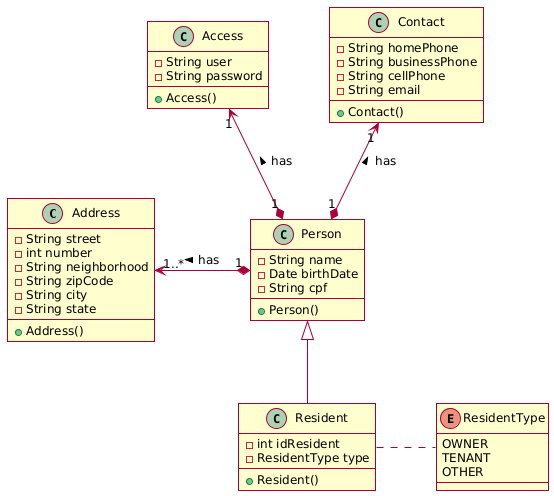

## MSResident

The microservice responsible for managing the condominium residents. The class diagram is shown below:

The microservice represented by the class diagram provides the following endpoints:
- General and specific search, insertion, update, and removal of <b>residents</b>

Implementation details are as follows:
- OpenJDK 21
- SpringFramework 3.4.4
- MongoDB 8.0.8