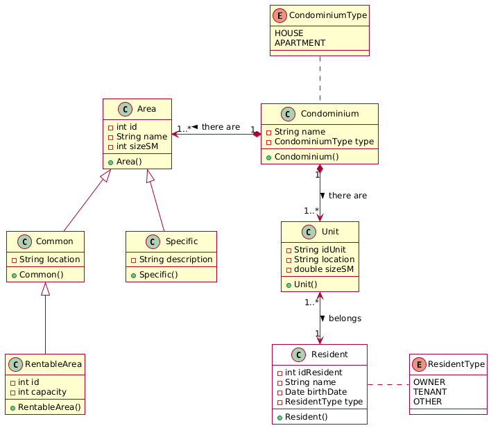
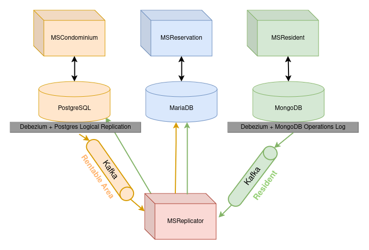

# A Real-time data synchronization approach for high-availability micro applications
Documentation of the case study explained in the arcticle 

# CondSys

A system for managing a network of condominiums must, by default, include mechanisms and functionalities such as access control, property sales, exchanges and rentals, reservation of common areas for events, and more.

This is the core idea behind the CondSys condominium system—a system already known and monitored by the study group that authored this paper—focusing on a specific functionality: <b>Reserving a rentable area</b>.

The choice of this functionality is justified by the fact that it requires data from different microservices, separated from the monolithic version of CondSys, aiming to maintain the Single Responsibility Principle for each microservice. Below is the documentation for each of these microservices.

## MSCondominium

Represents the microservice that controls the condominium network, the registration of its respective units, residents, and public areas of the condominium. The class diagram is shown below.

The microservice represented by the class diagram provides the following endpoints:

- General and specific search, insertion, update, and removal for <b>condominiums</b>;
- General and specific search, insertion, update, and removal for <b>units</b>;
- General and specific search, insertion, update, and removal for <b>rentable areas</b>;
- General and specific search for <b>residents</b>;

Residents do not have insertion, update, or removal endpoints because their data is replicated from another microservice (MSResident), mainly indicated by the white background of the class, denoting that it is not part of this microservice.

Implementation details are as follows:
- OpenJDK 21
- SpringFramework 3.4.4
- PostgreSQL 17.4

## MSResident

The microservice responsible for managing the condominium residents. The class diagram is shown below:

The microservice represented by the class diagram provides the following endpoints:
- General and specific search, insertion, update, and removal of <b>residents</b>

Implementation details are as follows:
- OpenJDK 21
- SpringFramework 3.4.4
- MongoDB 8.0.8

## MSReservation

Microservice for managing reservations of rentable areas, following the logic that a resident can rent a common rentable area for a specific purpose at a predetermined cost per area. This microservice is used to validate the case study, as it requires information contained in <b>rentable area</b> (MSCondominium) and <b>resident</b> (MSResident), and still needs a logical transformation of the objects to retrieve only the information necessary for the business rules of the application. The class diagram is shown below:

Note the difference between the resident and rentable area entities in the reservation microservice compared to the respective source data microservices. The notation that indicates it comes from another microservice is the white background of the class.

Implementation details are as follows:
- OpenJDK 21
- SpringFramework 3.4.4
- MariaDB 11.7.2

# Workflow

The workflow of the suggested approach follows the diagram below. The data is inserted through the microservices, and a fourth microservice—responsible solely for replication—performs the modifications between the data.

A generic replication instance in our approach follows these steps:
1. Data is inserted by the microservice into the database
2. Debezium captures the change in the database and transforms it into a standardized message
3. The message is placed in the Kafka messaging queue
4. The replicator application listens to the message from the topic and deserializes the changed entity
5. The entity is transformed into its version for the target database
6. The entity is saved in the target database

Specifically for this implementation, the application can propagate information to more than one target database, as is the case with the resident entity.

Implementation details are as follows:
- Debezium 2.6.1.Final
- Kafka 7.6.1
- Zookeeper 7.6.1

# Setup

To instantiate our execution, you must first clone the repository:

        git clone https://github.com/DanielAlmeida19/CaseStudyArticleSBES

DInside the folder of the cloned repository, you need to run the one that contains the necessary applications along with the microservices:

        docker compose -f 'compose.case-study.yml' up -d --build

For execution, it is recommended to have:
- Linux kerner 6.0 + | Windows 10 or higher
- Docker 26.0+ 
- 8GB of RAM